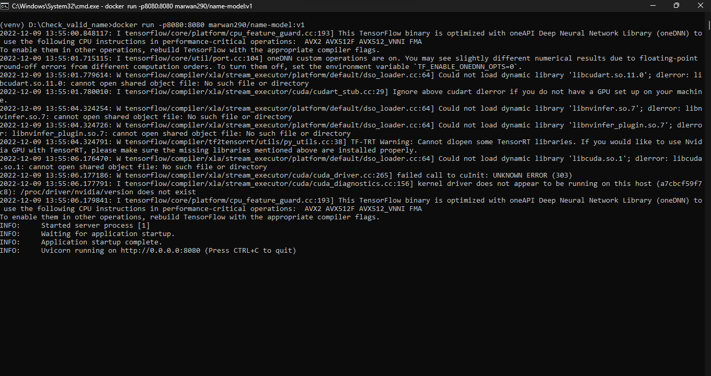

# Name Check

 This a project of creating a machine learning model that takes a text of three words (name) and check if it is correct name with a confidence threshold of your prediction

## Run without Docker

### Create Virtual Evironment

```
python -m venv <env_name>
<env_name>\Scripts\activate
```

```http://localhost:8080/docs
pip install -r requirements.txt
```
### Run the server 
```
python server.py
```
### from browser visit :  
```
http://localhost:8080/docs
```

 ### Examples of project running
<p align="center">

</p>


 ### Examples of result
<p align="center">

</p>

## Run With Docker

### Run this command

#### docker run -p8080:8080 marwan290/name-model:v1

 ### Examples of Docker Running
 <br>
<p align="center">

</p>

### from browser visit :  
```
http://localhost:8080/docs
```


